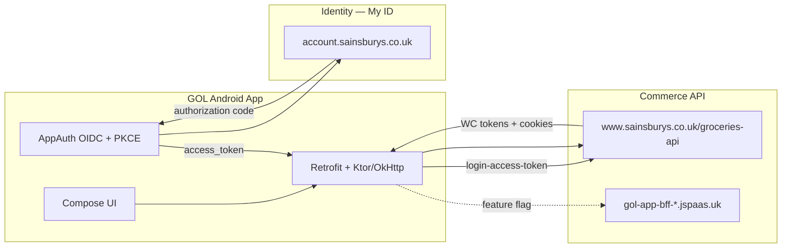

# Phase 1 — Completion Report

> Sainsbury's Groceries (`com.sainsburys.gol` v3.65.0) · Completed 2026-08-30

## Executive summary

Phase 1 reverse-engineered the Sainsbury's Groceries Android app to document its HTTP API, authentication model, and response schemas for smart-home integration. The app is **HTTP-only** (no Bluetooth). Business logic is heavily R8-obfuscated but Retrofit/Ktor interfaces and Gson models retain readable structure under `com.sainsburys.gol.*`.

Live validation was performed on a rooted Pixel 4 XL with Frida-instrumented OkHttp hooks. **183 authenticated API requests** were captured across Favourites, Trolley, Shop, and Home tabs. Static schemas were cross-checked against live JSON samples.

**Phase 2** (Python `pysainsburys` client) is unblocked. The main integration constraint is **Akamai bot protection** (`ak_bmsc` cookies; optional `X-acf-sensor-data` header from native BMP SDK).

---

## Architecture



---

## Authentication lifecycle

| Step | Action | Endpoint / storage |
|---|---|---|
| 1 | OIDC discovery (app startup) | `GET https://account.sainsburys.co.uk/.well-known/openid-configuration` |
| 2 | User login (WebView) | `GET …/oauth2/auth` + PKCE (`code_challenge_method=S256`) |
| 3 | Redirect with auth code | `sainsburys://oauth/redirect-login` |
| 4 | Token exchange | Token endpoint from discovery (Ory Hydra — `/oauth2/token`) |
| 5 | Commerce session | `POST /groceries-api/gol-services/login/v1/login-access-token` |
| 6 | Session persistence | `auth_state.preferences_pb`, `gol_hybrid.xml`, WebView cookies |
| 7 | API calls | `Authorization` + `WCAuthToken` + `Cookie` headers |

### OAuth / OIDC parameters (static + inferred)

| Parameter | Value |
|---|---|
| Issuer / auth base | `https://account.sainsburys.co.uk/` |
| Client ID | `gol-android` |
| Scopes | `openid offline gol-session` |
| Redirect (login) | `sainsburys://oauth/redirect-login` |
| Redirect (logout) | `sainsburys://oauth/redirect-logout` |
| PKCE | Required (`S256`) |
| Authorization URL | `https://account.sainsburys.co.uk/oauth2/auth` |
| Token URL | `https://account.sainsburys.co.uk/oauth2/token` (standard Ory Hydra layout) |
| Discovery URL | `https://account.sainsburys.co.uk/.well-known/openid-configuration` |
| Extra auth params | `missionId=gol`, `audience=gol.sainsburys.co.uk`, `channel=Android`, `appVersion=3.65.0` |

Discovery and token endpoints are **Akamai-protected** — direct `curl` from a datacenter IP returns 403. The app fetches discovery at runtime via AppAuth (`AuthorizationServiceConfiguration`).

### Commerce token exchange

**Request** (`LoginAccessPayload`):

```json
{
  "access_token": "<oauth_access_token>",
  "food_profile_create": true
}
```

**Response** (`WCSTokenEntity`):

```json
{
  "personalization_id": "1740501147938-35",
  "user_id": "682092082",
  "wc_token": "…",
  "wc_trusted_token": "…"
}
```

Validated IDs for test account: customer ID `168292530` (plain prefs), commerce user ID `682092082` (WC cookies).

### Authenticated request headers (live-validated)

```http
Authorization: Bearer <JWT RS256, ~1229 chars>
WCAuthToken: 682092082%2C<wc_trusted_token>
Cookie: ak_bmsc=…; WC_AUTHENTICATION_682092082=…; WC_SESSION_ESTABLISHED=true; JSESSIONID=…; AWSALB=…
User-Agent: GOLAppAndroid/3.65.0
Content-Type: application/json; charset=UTF-8
```

- `WCAuthToken` format: URL-encoded `{user_id},{wc_trusted_token}`
- `refresh_token` header appears on token-refresh flows only, not routine GETs
- Store context query params: `store_identifier=0474`, `personalization_id=…`, `slot_type=none`

---

## Live-validated endpoints

| Method | Path | Tab / trigger |
|---|---|---|
| GET | `/product/v1/favourites` | Favourites |
| GET | `/product/v1/favourites-by-pattern` | Favourites (seasonal/usuals) |
| GET | `/product/v1/recommendations` | Favourites |
| GET | `/product/v1/product/meganav` | Shop |
| GET | `/product/v1/product/taxonomy` | Shop |
| GET | `/basket/v2/basket` | Trolley |
| GET | `/customer/v1/customer/address` | Account context |
| GET | `/order/v1/order` | Orders |
| POST | `/content/v2/withMagnoliaTemplate/ads` | Home |

Full API reference: [`API.md`](API.md)

---

## Response samples

Live-captured JSON excerpts (no auth tokens) in [`samples/`](samples/):

| File | Endpoint | Notes |
|---|---|---|
| [`favourites-product.excerpt.json`](samples/favourites-product.excerpt.json) | `GET …/favourites` | Single product + pagination controls |
| [`order-list.empty.json`](samples/order-list.empty.json) | `GET …/order` | Empty order history shape |
| [`remote-config.excerpt.json`](samples/remote-config.excerpt.json) | S3 config | Public, no auth |

Static Gson models in `artifacts/…/com/sainsburys/gol/models/entities/` match live field names (`snake_case` JSON keys).

---

## Protections & Phase 2 implications

| Protection | Evidence | Impact on Python client |
|---|---|---|
| **Akamai Bot Manager** | `libakamaibmp.so`, `ak_bmsc` cookie on app requests | **Not required** for authenticated API calls when WC session is valid (live test 2026-08-30). WC cookies + `WCAuthToken` are the real session binders |
| **Certificate pinning** | OkHttp `CertificatePinner` | TLS interception requires bypass or direct API with valid session |
| **OAuth + WC dual auth** | Bearer JWT + WCAuthToken + cookies | Client needs both token layers |
| **Play sideload check** | Pair IP `LicenseClient` | N/A for API client |
| **BFF routing** | OkHttp interceptor rewrites paths | May need BFF host for basket/checkout/slot when flag enabled |
| **Root detection** | `libtoolChecker.so` | N/A for API client |

`X-acf-sensor-data` was **not observed** on routine browse traffic after login. Live curl tests (2026-08-30) confirmed **`ak_bmsc` / `bm_sz` / `_abck` cookies are not required** for authenticated grocery API calls when `WCAuthToken` and WC session cookies (`WC_*`, `JSESSIONID`) are present. Without WC cookies, basket returns HTTP 200 with an empty guest basket; favourites returns HTTP 401.

---

## Tooling & reproducibility

| Script | Purpose |
|---|---|
| `artifacts/scripts/run_live_capture.py` | Automated header + URL capture |
| `artifacts/scripts/capture_response_samples.py` | Response body sampling |
| `artifacts/scripts/live_capture.js` | Frida OkHttp hooks |
| `artifacts/scripts/capture.js` | SSL pinning + license bypass (mitmproxy) |
| `artifacts/scripts/attach_capture.py` | Frida CLI wrapper |

Capture recipe: clear app cache → cold start → attach Frida CLI → navigate tabs.

Raw captures (gitignored): `artifacts/captures/live-capture.log`, `response-samples.json`

---

## Open questions for Phase 2

1. **Akamai bypass strategy** — live tests show `ak_bmsc`/`bm_sz`/`_abck` are **not** needed with a valid WC session; focus on OAuth + WC token exchange instead
2. **BFF feature flag** — confirm whether v3.65.0 routes basket/checkout via BFF in production
3. **Token refresh** — capture `refresh_token` header flow when access token expires
4. **Write operations** — validate `POST …/basket/item` request/response with a test add-to-basket
5. **Smart-home priority workflows** — basket, orders, slots, favourites (user preference)

---

## References

- [`NOTEBOOK.md`](NOTEBOOK.md) — research log
- [`API.md`](API.md) — full endpoint reference
- [Sainsbury's My ID engineering post](https://medium.com/sainsburys-engineering/my-id-is-bringing-our-products-closer-together-fdbc988a0103) — Ory Hydra OAuth stack
